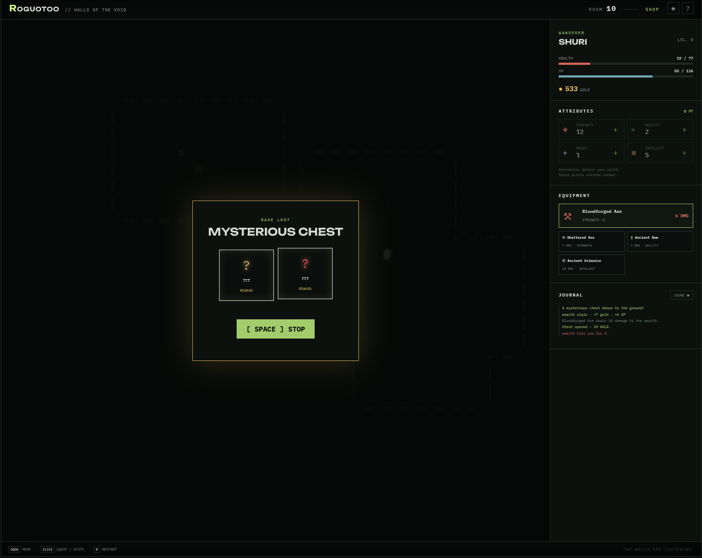

# Roguotoo — Halls of the Void

An open-source roguelike inspired by Nethack and Vampire Survivors. 

## Play

https://simon4dev.github.io/Roguotoo/

PC/mobile/tablet support

## Screenshot



## Run

Open `index.html`, or start a local server:

```powershell
python -m http.server 8000
```

Then open `http://localhost:8000`.

## Controls

- Select `ZQSD`, arrow keys, or `WASD` on the title screen
- `Space`: wait one turn or stop a chest reward roll
- Click the side menu to spend attribute points or equip a weapon
- `R`: restart

Equipment and attribute allocation are locked during combat. A procedural shop appears every five rooms.
